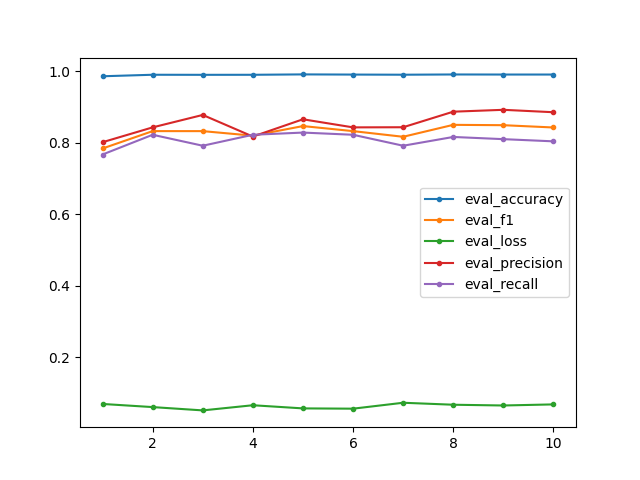

## `data`
Contains the annotated dataset used for training and evaluation, `dataset.json`. The dataset is in JSON lines format, each record having the following form: `{"url_id": url_id, "tokens": [token1, token2, ...], "ner_tags": [tag1, tag2, ...]}`. The dataset holds a total of 31369 records (extracted from a total of 258 urls), 11466 of which (extracted from 75 urls) were manually annotated and used for training and evaluation. The rest of the urls provided in `furniture stores pages.csv`, which was renamed as `urls.csv` eighter raised bad status codes or various errors, so text could not be extracted from them.

## `models`
Contains the best performing model resulted from training on `dataset.json`, `best_model`. This model was used to obtain the final results. The model folder was generated by `transformers.Trainer`.

## `results`
Contains the final results as given by `best_model`. `results_lines.json` stores the results in JSON lines format, while `results.json` stores the results in regular JSON, making it much less readable, but more convenient to use in code. Each record in `results_lines.json` is of the form `{"url_id": url_id, "url": url, "product": product}`. `url_id` is the index of the url in `urls.csv`, and `product` represents a product entity extracted from that url, as predicted by `best_model`.

Here are some result samples from unseen data:

```
{"url_id": 649, "url": "https://www.littletulip.com/products/set-200-marble-6", "product": "200 x 120 cm saarinen tulip table 6 side chair set"}
{"url_id": 653, "url": "https://www.abowed.co.uk/products/oak-four-poster-bed", "product": "bespoke modern four poster bed"}
{"url_id": 653, "url": "https://www.abowed.co.uk/products/oak-four-poster-bed", "product": "solid oak four poster bed with drapes"}
{"url_id": 653, "url": "https://www.abowed.co.uk/products/oak-four-poster-bed", "product": "solid oak four poster bed with drapes"}
{"url_id": 653, "url": "https://www.abowed.co.uk/products/oak-four-poster-bed", "product": "oak four poster bedapes"}
{"url_id": 653, "url": "https://www.abowed.co.uk/products/oak-four-poster-bed", "product": " poster bed"}
{"url_id": 653, "url": "https://www.abowed.co.uk/products/oak-four-poster-bed", "product": "solid oak four poster bed with drapes"}
{"url_id": 653, "url": "https://www.abowed.co.uk/products/oak-four-poster-bed", "product": "solid oak headboard"}
{"url_id": 653, "url": "https://www.abowed.co.uk/products/oak-four-poster-bed", "product": "modern , elegant four poster canopy"}
```

## `src`
Contains all the source code.

### `src/configs`
Contains the configuration used in the project in json format, `config.json`.
```
{
    "dataset": {
        "train_split": 0.8,
        "test_split": 0.2,
        "dev_split": false
    },
    "training_args": {
        "evaluation_strategy": "epoch",
        "learning_rate": 1e-4,
        "per_device_train_batch_size": 16,
        "per_device_eval_batch_size": 16,
        "num_training_epochs": 1,
        "weight_decay": 1e-5,
        "save_strategy": "epoch",
        "output_dir": "/home/victor-ii/Desktop/ML_Assignment/models",
        "load_best_model_at_end": true,
        "auto_find_batch_size": false,
        "gradient_checkpointing": true,
        "save_steps": 25,
        "eval_steps": 25,
        "evaluate": true
    },
    "model": {
        "num_labels": 3,
        "id2label": {"0": "O", "1": "B-product", "2": "I-product"},
        "label2id": {"O": 0, "B-product": 1, "I-product": 2},
        "pretrained_model_checkpoint": "distilbert-base-uncased",
        "inference_model_checkpoint": "/home/victor-ii/Desktop/ML_Assignment/models/best_model"
    },
    "paths": {
        "dataset": "/home/victor-ii/Desktop/ML_Assignment/data/dataset.json",
        "backup_dataset": "/home/victor-ii/Desktop/ML_Assignment/data/backups/dataset.json",
        "urls": "/home/victor-ii/Desktop/ML_Assignment/urls.csv",
        "results": "/home/victor-ii/Desktop/ML_Assignment/results/test.json"
    }
}
```
### `src/data`
Contains scripts for data processing and dataset creation.
#### `utils.py`

- `get_urls(path:str, to_list:bool=True) -> pd.DataFrame | list`: Takes in the path to the `urls.csv` file and generates a urls list
- `get_filtered_text_from_url(url: str) -> list[str] | None`: Takes in a url and gets its response using `requests.get()`. Calls `extract_and_filter_text()` on the response content only if the `status_code == 200` and no Exception is raised.
- `extract_and_filter_text(response_content:str) -> list[str]`: Takes in the response content of the request and extracts all text from it using the `BeautifulSoup.get_text()` method. This function also filters the text by eliminating any text from html tags such as `'meta', 'head', 'input', 'script', 'style', 'noscript', 'footer', 'header'` and eliminating all characters besides letters, numbers, spaces, commas and periods.
- `tokenize(sentences: list[str]) -> list[list]`: Takes in the list of texts returned by `get_filtered_text_from_url()` and tokenizes each element in the list using the SpaCy `en_core_web_sm` tokenizer.
- `create_dataset(urls: list) -> list[dict]`: Takes in the urls list generated by `get_urls()` and applies the `get_filtered_text_from_url()` and `tokenize()` methods on every url from the list generating the dataset.
- `save_dataset(dataset: list[dict], path:str) -> None`: Saves the dataset retured by `create_dataset()` to a JSON lines file, `dataset.json`
- `read_dataset(path:str, annotated_only:bool=False) -> list[dict]`: Reads the `dataset.json` file returning the data in `list[dict]` format. If `annotated_only` is False, the entire dataset is returned, otherwise only the annotated records are returned.
- `split_data(data:list[dict], train_split:float, test_split:float, dev:bool=True, seed:int=42) -> tuple[list[dict], list[dict], list[dict]] | tuple[list[dict], list[dict]]`: Takes in the dataset and splits it into partitions. If `dev` is True, the dataset is split into 3 partitions (train, test and dev) otherwise the dataset is split only in 2 partitions (train and test).
- `get_encodings_and_labels(data:list[dict], tokenizer:AutoTokenizer | Any) -> tuple[list[dict], list[int]]`: Tokenizes the text from the dataset using `transformers.AutoTokenizer.from_pretrained("distilbert-base-uncased")`, and realigns the labels.
- `convert_to_hf_dataset(encodings:list[dict], labels:list[int]) -> Dataset`: Takes in the encodings and labels returned by `get_encodings_and_labels()` and converts them into a `datasets.Dataset` object.
- `annotate_dataset(data:list[dict], start_index:int|None=None)`: Helper function which allows for easy manual annotation of data, by looping through each element and updating the ner tags according to user input. The data is annotated using BIO tagging.

#### `dataset.py`

Contains the `build_datasets(data_path:str, tokenizer:AutoTokenizer, train_split:float, test_split:float, dev:bool, seed:int)` method, which uses the methods in `utils.py` to return a list of 2 (if `dev == False`) or 3 `datasets.Dataset` objects, which will be used for training.

### `src/annotate_dataset.py`
Script used for dataset annotation, containing the `annotate_and_save(path, start_index:int|None=None) -> None` method. Uses the `read_dataset()`, `save_dataset` and `annotate_dataset` from `utils.py` to annotate the dataset, starting from `start_index` if specified otherwise from the first unannotated record.

### `src/config.py`
Script used to read the configuration, `config.json`. Contains the `get_config(path:str|None='config.json') -> dict` method.

### `src/train.py`
Contains the `train(model_checkpoint:str, num_labels:int, id2label:dict, label2id:dict, data_path:str, train_split:float, test_split:float, dev:bool, training_args:dict) -> None` method which builds the datasets, using the `build_datasets()` method, defines the `compute_metrics()` method, initializes the model using `model = AutoModelForTokenClassification.from_pretrained("distilbert-base-uncased")` and trains the model using `transformers.TrainingArguments()` and `transformers.Trainer()`. The training arguments are specified in `config.py`.

### `src.inference.py`
Contains the `inference(model_checkpoint:str, data_path:str, urls_path:str, save_path:str, lines:bool=True) -> None` method, which takes in the trained model path (`models/best_model`) and the path of the dataset to infer from (`data/dataset.json`), and creates `results_lines.json`.

### `src.visualize.py`

- `get_metrics(model_checkpoint:str) -> dict`: Takes in the path of the trained model and extracts the 'eval_accuracy', 'eval_f1', 'eval_loss', 'eval_precision', 'eval_recall' for each training epoch from `trainer_state.json` (found inside `models/best_model`). Returns a dictionary in the form of `metrics = {'eval_accuracy': [val1, ...], 'eval_f1': [val1, ...], 'eval_loss': [val1, ...], 'eval_precision': [val1, ...], 'eval_recall': [val1, ...]}`. The following is the metrics dict obtained from `best_model` after 10 epochs of training:
```
{'eval_accuracy': [0.9857437813391013, 0.9899714875626782, 0.9897748500639072, 0.9898731688132927, 0.9909546750565332,0.9904630813096057, 0.9900698063120638, 0.9907580375577623, 0.9905614000589913, 0.9905614000589913],
'eval_f1': [0.7836990595611286, 0.8322981366459629, 0.832258064516129, 0.8195718654434251, 0.8463949843260187, 0.8322981366459629, 0.8164556962025317, 0.8498402555910542, 0.8488745980707395, 0.8424437299035369],
'eval_loss': [0.06907624751329422, 0.06030609458684921, 0.051045238971710205, 0.06547477096319199, 0.05664968490600586, 0.05587960034608841, 0.0724363848567009, 0.0669035017490387, 0.06477952003479004, 0.06783446669578552],
'eval_precision': [0.8012820512820513, 0.8427672955974843, 0.8775510204081632, 0.8170731707317073, 0.8653846153846154, 0.8427672955974843, 0.8431372549019608, 0.8866666666666667, 0.8918918918918919, 0.8851351351351351],
'eval_recall': [0.7668711656441718, 0.8220858895705522, 0.7914110429447853, 0.8220858895705522, 0.8282208588957055, 0.8220858895705522, 0.7914110429447853, 0.8159509202453987, 0.8098159509202454, 0.803680981595092]}
```

- `plot_metrics(metrics:dict[list], save:bool=True) -> None`: Takes in the metrics returned by `get_metrics()` and plots them. Below is the plot of the above metrics:



